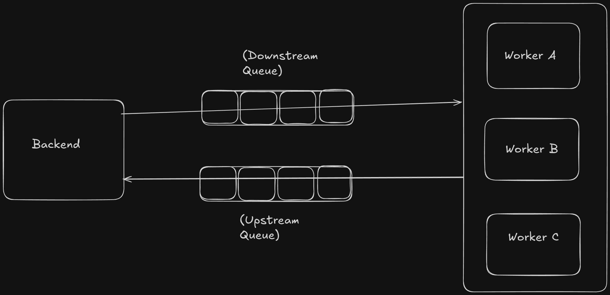

> **Purpose:** This document defines standards for building the async scraping microservice. Every code generation decision must align with these guidelines. When in doubt, refer back here before writing any code.

---

## 1. Project Overview & Architecture Philosophy

### 1.1 System Summary

This is an **asynchronous, distributed web scraping service** with the following top-level components:

| Component | Role |
|---|---|
| **FastAPI Backend** | REST API for task submission, monitoring, and management |
| **Celery Workers** | Async task executors that run site-specific scraping logic |
| **MongoDB** | Persistent storage — shared DB, separated by schema ownership |
| **AWS SQS** | Message broker between backend and workers |
| **Scrapy / BeautifulSoup / Playwright** | Scraping execution engines and frameworks |

### 1.2 Core Architecture Principles

- **Everything is asynchronous.** No synchronous I/O anywhere — not in the API, not in database operations.
    - Celery is synchronous so don't have any workaround in that to make it asynchronous hence **keep celery workers all operations synchronous**
- **Boundaries are sacred.** The backend and workers operate on distinct collections and must never cross schema ownership lines.
- **Composability first.** Every site scraper is an independent, composable unit. New scrapers must slot in without modifying existing code.
- **No magic dictionaries.** All data written to or read from needs to be structured leveraging Pydantic. No raw `dict` inserts. If possible use this principle for MongoDB operations too.
- **AWS credentials are injectable.** All AWS resource clients must work without hardcoded credentials and support credential injection for local testing.
- **Fail gracefully, retry intelligently.** Every scraping task must have retry logic, exponential backoff, and a dead-letter path, and ever scraping must be cancellable

---

## 2. Technology Stack

### 2.1 Runtime

```
Python: 3.12.x (latest stable)
```

### 2.2 Version Resolution Rule

- If a newer patch or minor version is available and backward-compatible, prefer it. Never pin to an exact version unless a breaking change is documented. Always use `>=` lower bounds.

---

## 3. Configuration & Environment Management

### 3.1 Single Source of Truth

All configuration lives in a `pydantic_settings` `BaseSettings` class. Never read `os.environ` directly anywhere in the codebase.

### 3.2 Environment File

Provide a `.env.example` at the project root. Every key used in `AppSettings` must have a corresponding example entry. Never commit a real `.env` file.

### 3.3 Rules

- All `Field(...)` (required fields) must be documented with `description=`.
- Optional AWS credentials use `str | None = None` — this is what allows the service to run without credentials in managed environments.
- Never validate or transform environment values outside of the `BaseSettings` class.
- Settings must be importable as a singleton: `from app.config import settings`.

---

## 4. Data Modeling with Pydantic v2
- Use `pydantic.BaseModel` for all data structures: API request/response bodies, internal DTOs.
- Use `model_config = ConfigDict(...)` — never the deprecated `class Config`.
- All fields with `datetime` type must be timezone-aware (`datetime` with `UTC`).
- Prefer `Annotated` field types for reusable validators over field-level validators.
- Never use `Any` in model fields unless absolutely unavoidable and documented.
- Use `Literal["value"]` types for discriminated unions.
- Enum fields must reference `shared/enums.py` definitions — never inline string values.
- All optional fields must explicitly be `FieldType | None = None` — never just `Optional[FieldType]` without the default.

## 5. MongoDB
- Consider best practice to use MongoDB
- do not use Custom Object ID rely on MongoDB define protocols
- But have a structure manner for MongoDB models operations, please avoid dynamic dictionaries
- use PyMongo the official libarary of MongoDB
- latest PyMongo supports the Async API instead of using Motor as later is deprecated
- Define indexes declaratively on startup. Never create indexes in request handlers or task bodies on the go.

## 6. Message Schema
- All SQS messages must conform to a defined Pydantic Schema

## 7. Scraping Framework Guidelines
### 7.1 BaseScraper Contract

Every site scraper must extend `BaseScraper`:

```python
# worker/scrapers/base.py
from abc import ABC, abstractmethod
from dataclasses import dataclass, field
from typing import Any


@dataclass
class ScrapePayload:
    url: str
    extra: dict = field(default_factory=dict)


@dataclass
class ScrapeResult:
    site: str
    url: str
    data: dict
    raw_html: str | None = None
    metadata: dict = field(default_factory=dict)


class BaseScraper(ABC):
    """
    Abstract base class for all site scrapers.
    Every scraper must implement `scrape()`.
    The `run()` method wraps it with retry, logging, and error normalization.
    """

    site_id: str  # must be defined on subclass, matches ScraperRegistry key

    def __init__(self, payload: dict) -> None:
        self.payload = ScrapePayload(**payload)

    @abstractmethod
    def scrape(self) -> ScrapeResult:
        """Core scraping logic. Raises ScrapeFailedError on failure."""
        ...

    def run(self) -> ScrapeResult:
        """Entry point called by Celery task. Do not override."""
        from shared.exceptions import ScrapeFailedError
        import structlog
        log = structlog.get_logger().bind(site=self.site_id, url=self.payload.url)
        log.info("scraper.started")
        try:
            result = self.scrape()
            log.info("scraper.completed")
            return result
        except Exception as exc:
            log.error("scraper.failed", error=str(exc))
            raise ScrapeFailedError(str(exc)) from exc
```

### 7.2 Scraper Registry

```python
# worker/scrapers/registry.py
from typing import Type
from worker.scrapers.base import BaseScraper
from shared.exceptions import ScraperNotFoundError

_REGISTRY: dict[str, Type[BaseScraper]] = {}


def register_scraper(site_id: str):
    """Decorator to register a scraper class."""
    def decorator(cls: Type[BaseScraper]) -> Type[BaseScraper]:
        cls.site_id = site_id
        _REGISTRY[site_id] = cls
        return cls
    return decorator


class ScraperRegistry:
    @staticmethod
    def get(site_id: str) -> Type[BaseScraper]:
        if site_id not in _REGISTRY:
            raise ScraperNotFoundError(f"No scraper registered for site: {site_id}")
        return _REGISTRY[site_id]

    @staticmethod
    def all_sites() -> list[str]:
        return list(_REGISTRY.keys())
```

### 7.3 Site Scraper Implementation Pattern

```python
# worker/scrapers/sites/example_site_a.py
from bs4 import BeautifulSoup
import httpx
from worker.scrapers.base import BaseScraper, ScrapeResult
from worker.scrapers.registry import register_scraper
from shared.exceptions import ScrapeFailedError


@register_scraper("example_site_a")
class ExampleSiteAScraper(BaseScraper):
    BASE_URL = "https://example-site-a.com"

    def scrape(self) -> ScrapeResult:
        try:
            response = httpx.get(self.payload.url, timeout=30)
            response.raise_for_status()
        except httpx.HTTPError as exc:
            raise ScrapeFailedError(f"HTTP error: {exc}") from exc

        soup = BeautifulSoup(response.text, "lxml")
        data = self._extract(soup)

        return ScrapeResult(
            site=self.site_id,
            url=self.payload.url,
            data=data,
            raw_html=response.text,
        )

    def _extract(self, soup: BeautifulSoup) -> dict:
        # Site-specific extraction logic
        return {
            "title": soup.find("h1").get_text(strip=True) if soup.find("h1") else None,
        }
```

### 7.4 Scrapy Integration

Use Scrapy for paginated or deeply crawled sites. Scrapy spiders must run in-process via `CrawlerRunner`:

```python
from scrapy.crawler import CrawlerRunner
from scrapy.utils.project import get_project_settings
from twisted.internet import reactor, defer


def run_spider(spider_cls, **kwargs) -> list[dict]:
    results = []
    settings = get_project_settings()
    runner = CrawlerRunner(settings)

    @defer.inlineCallbacks
    def crawl():
        yield runner.crawl(spider_cls, results=results, **kwargs)
        reactor.stop()

    crawl()
    reactor.run()
    return results
```

### 7.5 Playwright Integration

Use Playwright only when JavaScript rendering is required. Always use async Playwright in an isolated context:

```python
from playwright.sync_api import sync_playwright


def scrape_with_playwright(url: str) -> str:
    with sync_playwright() as p:
        browser = p.chromium.launch(headless=True)
        context = browser.new_context()
        page = context.new_page()
        page.goto(url, timeout=30000)
        page.wait_for_load_state("networkidle")
        content = page.content()
        browser.close()
    return content
```

> **Note:** Use `sync_playwright` in Celery worker context (synchronous). Use `async_playwright` only in async FastAPI routes if needed for live preview endpoints.

### 7.6 Framework Selection Rules

| Scenario | Framework |
|---|---|
| Simple static HTML, single page | BeautifulSoup + httpx |
| Multi-page crawl, pagination, link following | Scrapy |
| JavaScript-rendered content (SPAs) | Playwright |
| Mixed (crawl + JS) | Scrapy-Playwright plugin |

---

## 8. Database Boundary & Ownership Rules

### 8.1 Collection Ownership Matrix

| Collection | Owner | Who Can Read | Who Can Write |
|---|---|---|---|
| `tasks` | **Backend** | Backend only | Backend only |
| `scrape_results` | **Worker** | Worker only | Worker only |
| `scrape_errors` | **Worker** | Worker only | Worker only |

### 8.2 Enforcement Mechanism

- Backend's `app/db/` directory must **never import** from `worker/db/`.
- Worker's `worker/db/` directory must **never import** from `app/db/`.
- Both sides import from `shared/` only.
- If the backend needs to read scrape results, it must do so through a **SQS callback message** — not by directly querying worker-owned collections.

### 8.3 Cross-Boundary Communication

```
Backend → (SQS dispatch queue) → Worker
Worker  → (SQS result queue)   → Backend
```

No direct DB reads across boundaries. Status updates flow via SQS messages, not DB polling.


## 9. Task Lifecycle & Status Management

### 9.1 Task Status Enum

```python
# shared/enums.py
from enum import Enum


class TaskStatus(str, Enum):
    PENDING = "pending"       # created, not yet dispatched
    QUEUED = "queued"         # dispatched to SQS
    STARTED = "started"       # worker picked up the task
    RUNNING = "running"       # scrape in progress
    COMPLETED = "completed"   # scrape finished successfully
    FAILED = "failed"         # terminal failure after retries
    RETRYING = "retrying"     # temporary failure, retry scheduled
    CANCELLED = "cancelled"   # manually cancelled
```

### 9.2 Status Transition Rules

Valid transitions only:

```
PENDING → QUEUED → STARTED → RUNNING → COMPLETED
                                     → FAILED
                                     → RETRYING → RUNNING
         → CANCELLED (from any non-terminal state)
```

## 10. Error Handling & Resilience Patterns

### 10.1 Exception Hierarchy

```python
# shared/exceptions.py


class ScrapingServiceError(Exception):
    """Base exception for all service errors."""


class ConfigurationError(ScrapingServiceError):
    """Invalid or missing configuration."""


class ScraperNotFoundError(ScrapingServiceError):
    """No scraper registered for the given site ID."""


class ScrapeFailedError(ScrapingServiceError):
    """Scraping operation failed — eligible for retry."""


class ScrapeParseError(ScrapingServiceError):
    """Data extraction/parsing failed — not retryable."""


class DatabaseError(ScrapingServiceError):
    """MongoDB operation failed."""


class QueueError(ScrapingServiceError):
    """SQS send/receive failed."""


class TaskNotFoundError(ScrapingServiceError):
    """Requested task does not exist."""


class InvalidTaskTransitionError(ScrapingServiceError):
    """Attempted an invalid task status transition."""
```

### 10.2 Retry Configuration with Tenacity

For non-Celery retry scenarios (e.g., SQS send, HTTP calls in scrapers):

```python
from tenacity import (
    retry,
    stop_after_attempt,
    wait_exponential,
    retry_if_exception_type,
    before_sleep_log,
)
import structlog

log = structlog.get_logger()


@retry(
    stop=stop_after_attempt(3),
    wait=wait_exponential(multiplier=1, min=2, max=30),
    retry=retry_if_exception_type((httpx.TimeoutException, httpx.ConnectError)),
    before_sleep=before_sleep_log(log, log_level=20),
    reraise=True,
)
def fetch_with_retry(url: str) -> httpx.Response:
    return httpx.get(url, timeout=30)
```

### 10.3 Dead Letter Handling

Tasks that exhaust all retries must:
1. Be marked `FAILED` in MongoDB.
2. Log a structured error event with `task_id`, `site`, `error`, `retry_count`.

### 10.4 HTTP Error Status Codes

| Scenario | HTTP Status |
|---|---|
| Task not found | 404 |
| Invalid task transition | 409 Conflict |
| Validation error | 422 Unprocessable Entity |
| Queue dispatch failure | 503 Service Unavailable |
| Internal unexpected error | 500 |

---

## 11. Logging & Observability

### 11.1 Structured Logging with structlog

```python
# shared/logging.py
import structlog
import logging
from app.config import settings


def configure_logging() -> None:
    structlog.configure(
        processors=[
            structlog.contextvars.merge_contextvars,
            structlog.stdlib.add_log_level,
            structlog.stdlib.add_logger_name,
            structlog.processors.TimeStamper(fmt="iso"),
            structlog.processors.StackInfoRenderer(),
            structlog.dev.ConsoleRenderer() if settings.debug
            else structlog.processors.JSONRenderer(),
        ],
        wrapper_class=structlog.make_filtering_bound_logger(
            logging.getLevelName(settings.log_level)
        ),
        context_class=dict,
        logger_factory=structlog.PrintLoggerFactory(),
    )
```

### 11.2 Log Field Standards

Every log event in tasks and scrapers must include these fields:

| Field | Type | Description |
|---|---|---|
| `task_id` | str | Unique scraping task identifier |
| `site` | str | Site scraper identifier |
| `event` | str | Dot-namespaced event name (e.g., `scraper.started`) |
| `level` | str | `info`, `warning`, `error` |
| `timestamp` | ISO 8601 | Auto-added by structlog |

### 11.3 Celery Monitoring Endpoint

```python
# app/api/v1/monitoring.py
from celery.app.control import Inspect
from worker.celery_app import celery_app


@router.get("/celery/stats")
async def celery_stats() -> dict:
    inspect = celery_app.control.inspect(timeout=5)
    return {
        "active": inspect.active(),
        "scheduled": inspect.scheduled(),
        "reserved": inspect.reserved(),
        "stats": inspect.stats(),
        "registered": inspect.registered(),
    }


@router.get("/celery/health")
async def celery_health() -> dict:
    ping = celery_app.control.ping(timeout=5)
    healthy = bool(ping)
    return {"healthy": healthy, "workers": list(ping.keys()) if ping else []}
```

### 11.4 Task Status Monitoring

```python
@router.get("/tasks/{task_id}/status")
async def get_task_status(
    task_id: str,
    task_service: TaskService = Depends(get_task_service),
) -> dict:
    task = await task_service.get_task(task_id)
    if task is None:
        raise HTTPException(status_code=404, detail="Task not found")
    return {
        "task_id": task_id,
        "status": task.status,
        "retry_count": task.retry_count,
        "celery_task_id": task.celery_task_id,
        "created_at": task.created_at,
        "updated_at": task.updated_at,
    }
```

---

## 12. Security Practices

### 12.1 Secrets Management

- Never log AWS credentials, MongoDB URIs, or any secret values.
- All sensitive config fields must be annotated with `Field(repr=False)` to prevent accidental logging.
- Rotate secrets via environment — never embed in source.

### 12.2 Input Validation

- All API inputs are validated by Pydantic before reaching service layer.
- URL fields in scraper payloads must be validated with `pydantic.AnyHttpUrl`.
- Scraper `site` field must be validated against `ScraperRegistry.all_sites()` at task creation time.

### 12.3 MongoDB Injection Prevention

- Never construct MongoDB queries by string interpolation.
- Always use parameterized filter dicts: `{"field": value}` — never `{"$where": f"this.field == '{value}'"}`.
